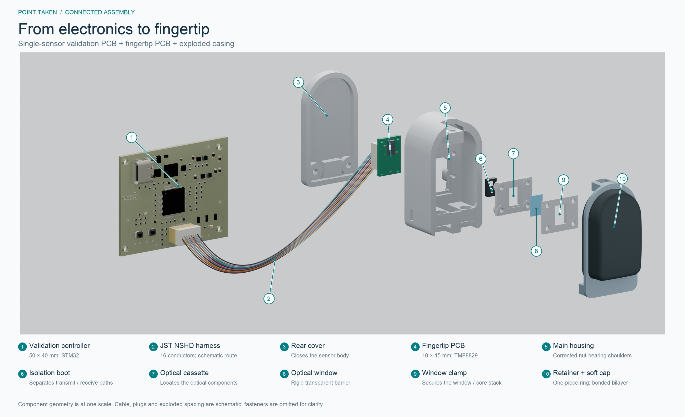
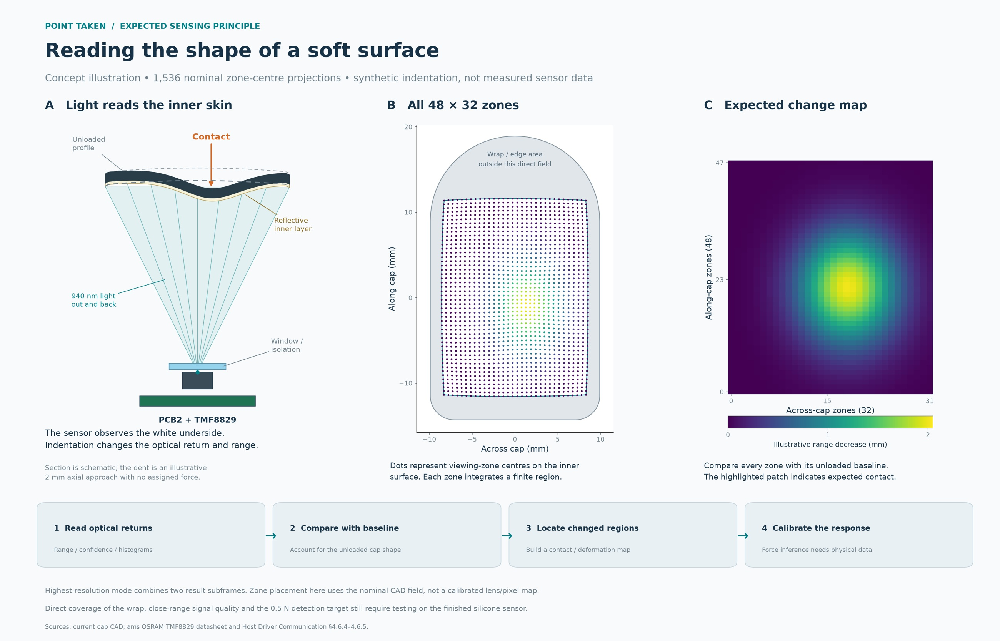
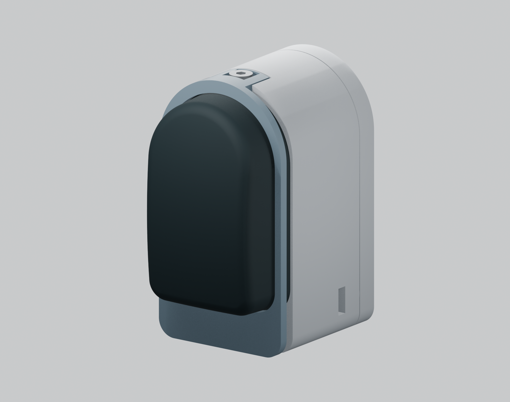

# Point Taken — An Optical Tactile Fingertip

A compact optical tactile fingertip built around the **ams OSRAM TMF8829**. A soft silicone surface deforms under contact; the sensor observes the changing distance to its reflective inner layer. Force and contact information must be obtained through calibration.

*Connected electronics and exploded sensor assembly. Cable routing and exploded spacing are schematic.*

*Expected sensing principle. The zone projection and deformation example are illustrative, not calibrated measurements.*

  

## Repository layout

| Folder | Contents |
| --- | --- |
| [PCBs/](PCBs/) | Native KiCad projects for the five-sensor controller, single-sensor validation rig and fingertip board, plus shared symbols, footprints and 3D reference models. |
| [CAD/Sensor/](CAD/Sensor/) | Corrected sensor housing, one-piece cap retainer, optical parts, compliant-surface geometry, assembled STEP and printable rigid-part STLs. |
| [docs/](docs/) | Material notes, assembly instructions, harness pinout and manufacturer references. |

## Design specifications

| Property | Current design |
| --- | --- |
| Sensing IC | TMF8829 direct time-of-flight sensor; up to **48 ×32 zones** and **940 nm** near-infrared illumination. |
| Sensor enclosure | **24.2 mm wide ×44.5 mm high ×33.8 mm deep**, including the rear locating posts. |
| Fingertip PCB | **10 ×15 mm**, four copper layers, one TMF8829 and four 1.20 mm mounting holes. |
| Main controller | **50 ×50 mm**, six layers, STM32H573ZIT6 and up to five sensor ports; placement complete, **unrouted**. |
| Validation controller | **50 ×40 mm**, six layers, STM32H562RIT6 and one sensor port; routed prototype. |
| Sensor connection | 16-conductor JST NSHD wire harness; SPI primary, optional I3C/I2C lines. |
| Supply architecture | Protected 5 V USB-C controller input; 3.3 V and 1.8 V sensor rails, with an explicit I/O supply. |
| Compliant skin | Nominal **0.90 mm black outer layer +0.30 mm white inner layer**, 1.20 mm total. |
| Target-motion allowance | **6 mm** optical travel allocation; not a measured deformation or force rating. |
| Front retention | **One-piece ring**, three M2 ×6 screws, mechanically captured silicone flange/bead. |
| Rear retention | Two **M2 ×8 screws** for the standalone sensor; side-loaded M2 nuts bear on 4 mm housing shoulders. |

IC capabilities are from the [TMF8829 manufacturer information](https://ams-osram.com/products/sensor-solutions/direct-time-of-flight-sensors-dtof/ams-tmf8829-48x32-multi-zone-time-of-flight-sensor). They do not establish this prototype's effective tactile resolution, frame rate or calibrated force accuracy.

## What the deformable surface should be made from

The current prototype material candidate is **Smooth-On Ecoflex 00-30 platinum-cure silicone**, cast as a bonded two-layer membrane:

- **Outside:** approximately 0.90 mm of black-pigmented silicone to provide the contact surface and block ambient light.
- **Inside:** approximately 0.30 mm of white, titanium-dioxide-filled silicone to provide a diffuse reflective target at 940 nm.

The flexible cap is a cast silicone part. The files in `CAD/Sensor/print/` are the rigid parts intended for 3D printing; compliant-surface meshes describe the casting geometry.

[Ecoflex 00-30 manufacturer instructions](https://www.smooth-on.com/products/ecoflex-00-30/) specify a 1A:1B base mix. Follow the current technical bulletin for preparation and curing. **Pigment/TiO₂ loading and the two-layer bonding process are not yet qualified** for this cap. Black appearance alone does not prove infrared opacity, and white appearance does not establish adequate sensor return. See [Materials](docs/Materials.md) before casting.

## Sensitivity and load targets

These are **design targets, not measured specifications**:

- Detect **0.5 N normal contact**, at least five standard deviations above unloaded repeatability noise over the central 80% of the contact surface.
- Stretch goal: **0.10–0.25 N** detection.
- Produce at least **0.25 mm local target displacement at 0.5–1.0 N** centre load.
- Original mechanical goals: **30 N normal load and 75 N brief overload**. These have not been established for the current cap/housing.

The current state is **a CAD-checked hardware prototype awaiting physical qualification**. CAD clearance checks do not prove sensitivity, tear resistance, layer adhesion, fatigue, creep or overload survival. The single-sensor validation rig and fingertip PCB have routing; the five-sensor controller remains on manufacturing hold. No fabrication or assembly approval is implied by this publication.

## Open and build

1. Open a `.kicad_pro` from [PCBs/](PCBs/) using **KiCad 10** with its standard libraries installed. Project-local library paths are portable.
2. Open [sensor_assembly.step](CAD/Sensor/sensor_assembly.step) in FreeCAD or another STEP-compatible CAD tool. All CAD dimensions are millimetres.
3. Use the **five rigid-part STLs** in [CAD/Sensor/print/](CAD/Sensor/print/), and read the [assembly instructions](docs/Assembly.md). The corrected main housing and one-piece retainer are included.
4. Verify printed nut fits, layer construction and the actual electronics before powered testing. Calibrate the finished silicone article before interpreting deformation as force.

The STEP files provide editable solid geometry; native parametric feature history is not included in this publication. Manufacturer reference documents and component models are identified in [References](docs/References.md).
